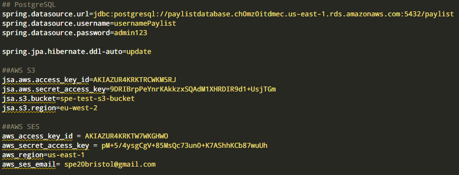
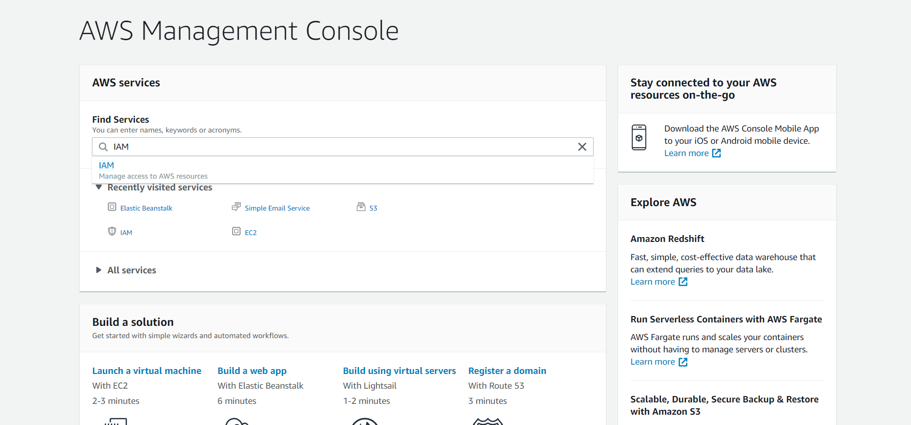
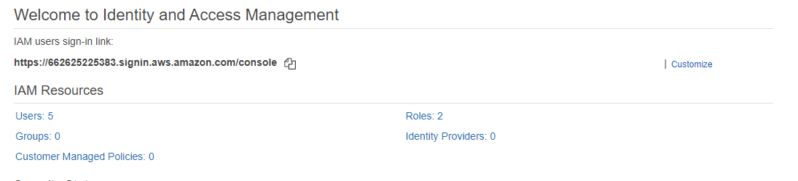
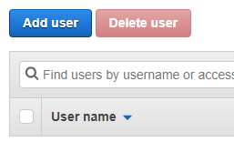
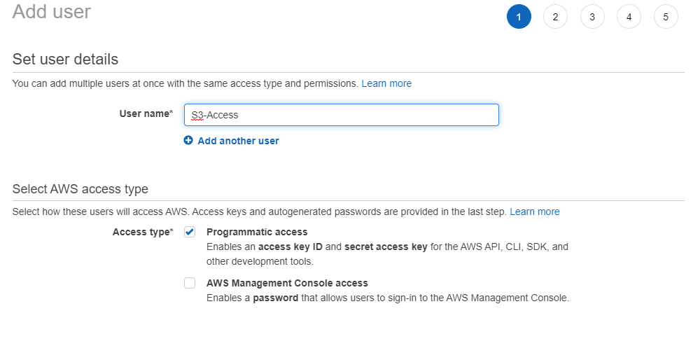
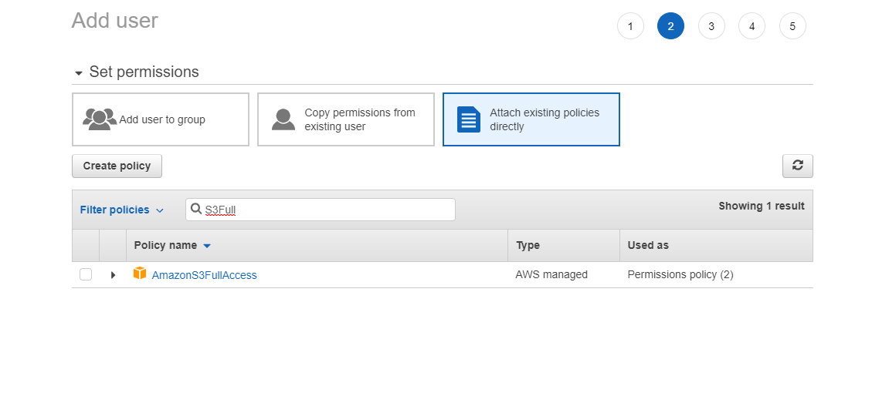

# Client Documentation

## Deployment Instructions
To deploy the product, we use the following tutorial:
https://www.javacodegeeks.com/2019/10/deploy-spring-boot-application-aws-ec2-instance.html

This allows you to deploy the product onto an EC2 instance using Amazon Web Services.
To package the product into an executable jar file, run the command 'mvn package'. This is what will be needed to upload onto the EC2 instance. Make sure this is done after application.properties is modified as shown in Technical Developer Documentation.

Once deployed navigate to your-domain.com:8080/view, this will display the view page of the system.

## Technical Developer Documentation
The source code can be run 

Currently the system uses testing accounts for AWS and Email Accounts. So, to change this to other accounts the product has been created so that all the information can be changed in one file, application.properties. This can be found at 'src/main/resources/application.properties'.

Below is a screenshot of this file:

### The Database
The database can be launched using this tutorial:

https://aws.amazon.com/getting-started/tutorials/create-connect-postgresql-db/

Once launched the first 3 fields need to be modified to allow the system to connect to the database. The tutorial provided will explain what each field will be. Once connected the system should be able to create an invoice table on its own using Spring Data JPA.

### AWS S3
To create an S3 bucket follow this tutorial:
https://docs.aws.amazon.com/quickstarts/latest/s3backup/step-1-create-bucket.html

An IAM User will need to be created with S3 Full Access permissions given.
To do this navigate to the AWS Management Console and search for IAM and click the option that appears.
 

Then on the next page that loads click Users.

Then click Add User.

Then type an appropriate username, and make sure programmatic access is ticked, this will allow you to generate the access keys needed in application properties.

Next to give the correct permissions, click 'Attach existing policies directly', and search for 'AmazonS3FullAccess' and tick the box to the left of it.

Then click next until you get to the review page, make sure everything is correct and click create user. Download the .csv and add these credentials to the application.properties file.

To receive emails into the bucket, follow the tutorial provided here:

https://aws.amazon.com/premiumsupport/knowledge-center/ses-receive-inbound-emails/

Make sure the prefix for the received files is set to 'emails/' otherwise the system will not know where to look.

### AWS SES
To send confirmation emails, an email address needs to be verified to send from this can be done using this tutorial:
https://docs.aws.amazon.com/ses/latest/DeveloperGuide/verify-email-addresses.html

Most likely your AWS account will have what is called sandbox status and so you'll only be able to send emails to verified email addresses, to get past this you can request your account is removed of this status in their support centre.

For application.properties, you need to make sure you set the correct region that you selected for SES and the email you wish to use to send from. You also need another IAM User for the access keys.

To do this follow the same tutorial S3 uses however instead of selecting AmazonS3FullAccess select AmazonSESFullAccess.

## API Documentation
The documentation for the API, which describes what each API does is included in a file located at 'images/api-doc.png', that is too big to display in this document.